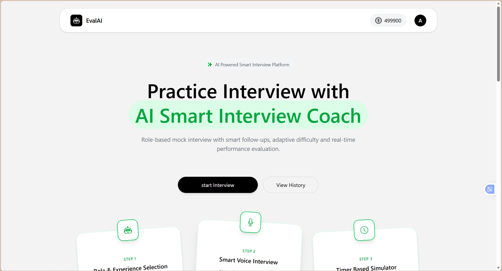
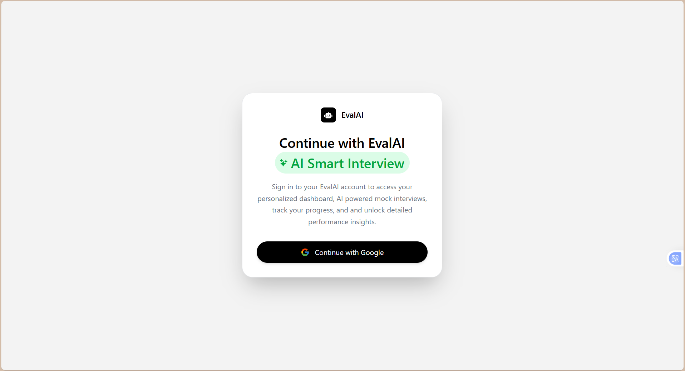
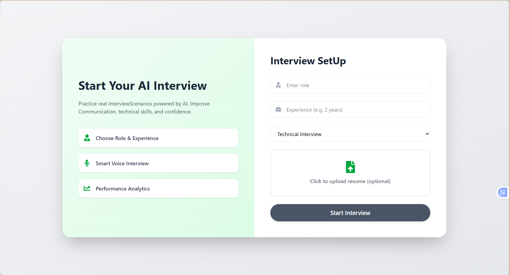
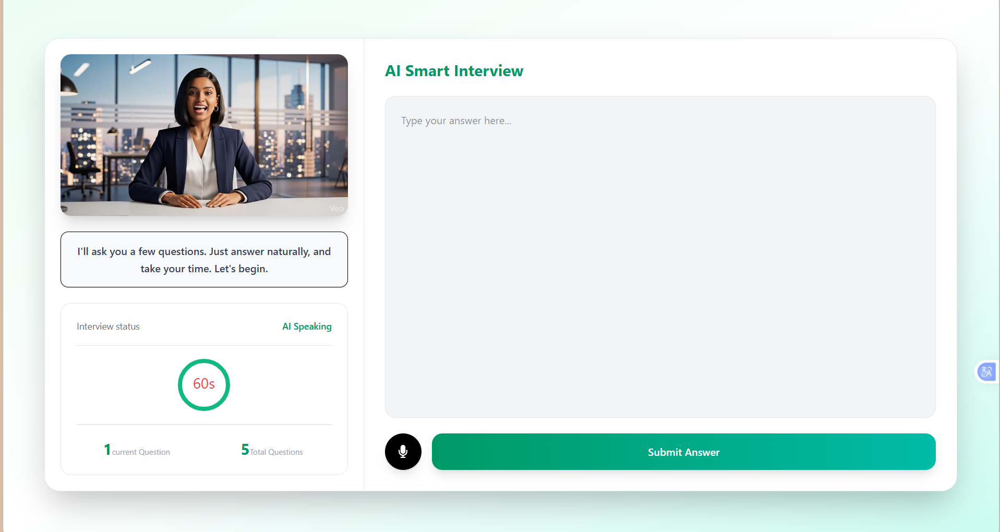
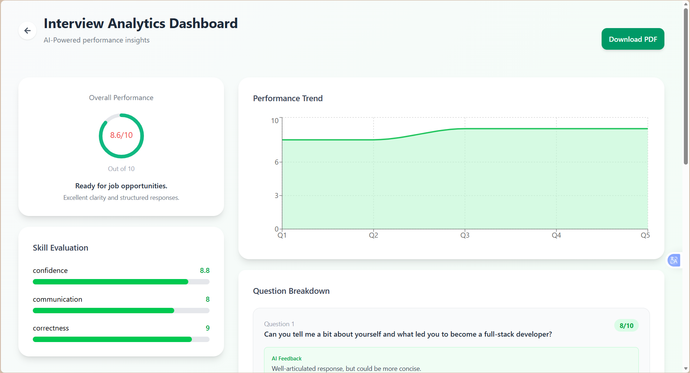
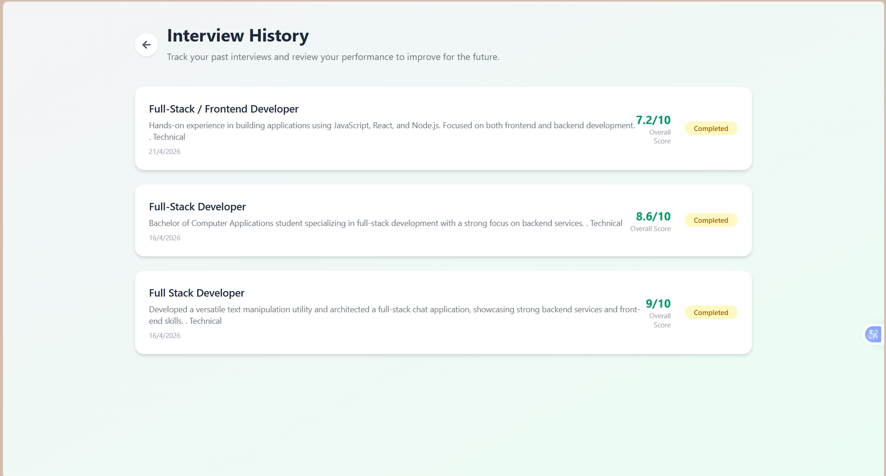
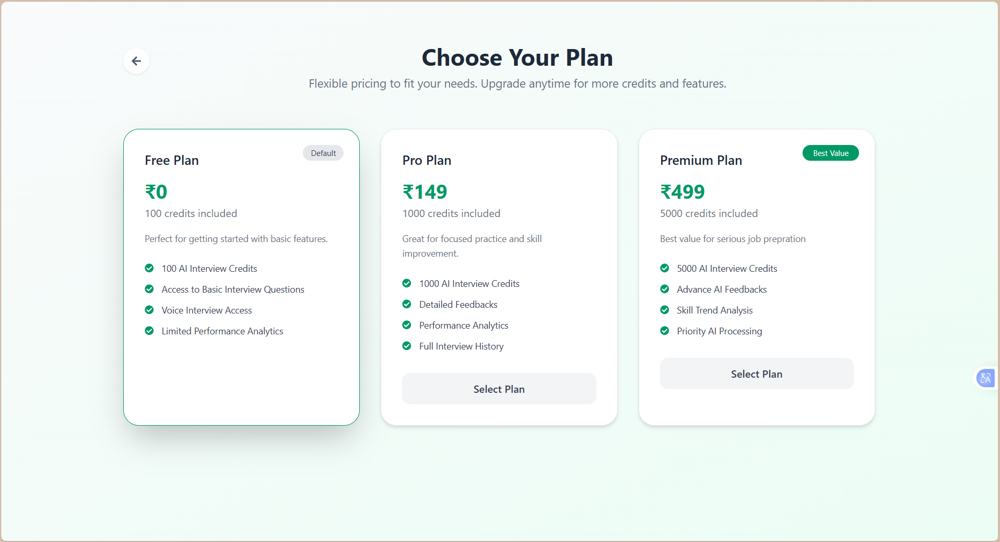

# 🤖 AI-Interview-Agent (EvalAI)

AI-Interview-Agent, also shown in the UI as **EvalAI**, is a full-stack web application that helps you practice interviews in a realistic way. It uses AI to generate questions, lets you answer using your voice, and gives you detailed feedback on how you performed.

---

## 🚀 What You Can Do With It

- Sign in easily using your Google account
- Upload your resume (PDF) to get more relevant questions
- Generate a complete mock interview with AI
- Answer questions using your voice
- Get instant feedback on:
  - Confidence
  - Communication
  - Correctness
  - Overall score
- View a detailed report after the interview
- Download your report as a PDF
- Check your past interview history anytime
- Use a simple credits system to manage usage

---

## 🛠 Tech Stack

### Frontend
- React 19 (with Vite)
- React Router
- Redux Toolkit
- Axios
- Tailwind CSS v4
- Motion (for animations)
- Recharts (for analytics)
- react-circular-progressbar
- jsPDF + jspdf-autotable (PDF generation)
- Firebase Authentication (Google login)

### Backend
- Node.js
- Express 5
- MongoDB with Mongoose
- JWT authentication (stored in HTTP-only cookies)
- cookie-parser
- CORS
- multer (file uploads)
- pdfjs-dist (resume parsing)
- Axios

### AI
- OpenRouter API
- Model used: `openai/gpt-4o-mini`

---

## 📁 Project Structure
- AI-Interview-Agent/

  ├── client/ # Frontend (React app)
  ├── server/ # Backend (API)
  └── README.md

---

## ⚙️ How the App Works

1. You sign in using Google.
2. The frontend sends your name and email to the backend.
3. Backend creates (or finds) your account and logs you in using a JWT cookie.
4. You go to the interview setup page.
5. You can upload your resume (optional).
6. You enter:
   - Role
   - Experience
   - Interview mode (Hr / Technical / Managerial)
7. The backend generates **5 questions** with increasing difficulty.
8. During the interview:
   - AI reads out questions
   - You answer using your voice
   - Each answer is evaluated instantly
9. Once done:
   - Final scores are calculated
   - Interview is marked as completed
10. You can:
   - View your report
   - Download it as PDF
   - Check your past interviews

---

## 📡 API Endpoints

| Method | Endpoint | Purpose | Auth Required |
|--------|---------|--------|--------------|
| POST | `/api/auth/google` | Login with Google | ❌ |
| POST | `/api/auth/logout` | Logout | ❌ |
| GET | `/api/user/current-user` | Get logged-in user | ✅ |
| POST | `/api/interview/resume` | Upload resume (PDF) | ✅ |
| POST | `/api/interview/generate-questions` | Generate questions | ✅ |
| POST | `/api/interview/submit-answer` | Submit answer | ✅ |
| POST | `/api/interview/finish` | Finish interview | ✅ |
| GET | `/api/interview/get-interview` | Interview history | ✅ |
| GET | `/api/interview/report/:interviewId` | Get report | ✅ |

---

## 🔐 Authentication Flow

- Google login is handled on the frontend using Firebase
- Backend receives user info and generates a JWT
- JWT is stored in an HTTP-only cookie (`token`)
- Protected routes verify this cookie
- Logout clears the cookie

---

## 💾 Database Models

### User
- name (required)
- email (required, unique)
- credits (default: 100)

### Interview
- userId
- role
- experience
- mode
- resumeText
- questions (array with question + answer + score details)
- finalScore
- status (Incomplete / Completed)
- timestamps

---

## 💳 Credits System (Simple Logic)

- Every user starts with **100 credits**
- Generating one interview costs **50 credits**
- You can only generate an interview if you have at least **50 credits**

---

## 📊 Interview Structure

### Questions

| Question | Difficulty | Time |
|----------|------------|------|
| 1 | Easy | 60 sec |
| 2 | Medium | 90 sec |
| 3 | Medium | 90 sec |
| 4 | Hard | 120 sec |
| 5 | Very Hard | 120 sec |

### Rules

- If you don’t answer → score = 0
- If time runs out → score = 0
- Otherwise → AI evaluates your answer

### Final Report Includes

- Final Score
- Average Confidence
- Average Communication
- Average Correctness
- Question-wise feedback

---

## 🌍 Environment Variables

### Server (.env)
- PORT=5000
- MONGO_URI=your_mongodb_uri
- JWT_SECRET_KEY=your_secret_key
- OPENROUTER_API_KEY=your_api_key

### Client (.env)
- VITE_FIREBASE_APIKEY=your_firebase_key
- VITE_API_BASE_URL=http://localhost:5000

⚠️ Don’t push real keys to GitHub. Always use placeholders.

---

## 🧑‍💻 Run Locally

### Requirements

- Node.js (LTS)
- npm
- MongoDB (local or Atlas)
- Firebase project (Google auth enabled)
- OpenRouter API key

---

### Backend Setup
- cd server
- npm install
- npm run dev

Runs on:
http://localhost:5000

---

### Frontend Setup
- cd client
- npm install
- npm run dev

Runs on:
http://localhost:5173

---

## 📜 Scripts

### Client
- npm run dev
- npm run build
- npm run lint
- npm run preview

### Server
- npm run dev
- npm start

---

## 🖼 Screenshots (Add Your UI Here)

> You can replace these with your actual screenshots

### Landing Page

### Login Page

### Interview Setup

### Interview Screen

### Report Page

### History Page

### Upgrade Page

---

## ⚠️ Known Limitations

- Voice input works best in supported browsers (like Chrome)
- Needs internet for AI responses
- Only PDF resumes are supported

---

## 🚧 Future Improvements

- More interview types
- Better voice recognition
- Multi-language support
- More advanced analytics

---

## 🛠 Troubleshooting

- Getting 401 on `/current-user`?
  - That’s normal if you're not logged in

- Backend not starting?
  - Check your `.env` file
  - Verify all imports

- CORS issues?
  - Make sure frontend URL is allowed
  - Enable `withCredentials`

- Resume parsing not working?
  - Use `pdfjs-dist` legacy build

---

## 🔒 Security Notes

- Never expose API keys
- Use HTTP-only cookies for auth
- Rotate keys if they get leaked

---

## 📄 License

Add your license here

---

## 👤 Author

Akash Chawla  
[GitHub](https://github.com/MidnightDev024)  
[LinkedIn](https://www.linkedin.com/in/akash-chawla-81008734b/)